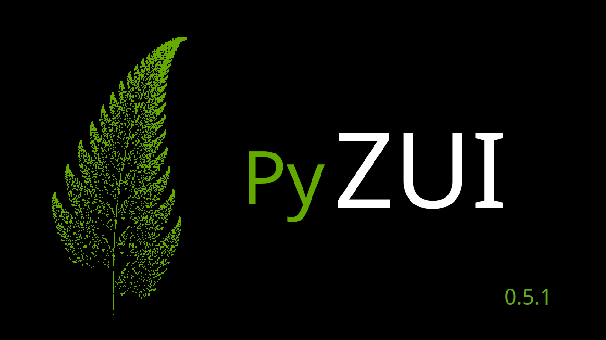

.. PyZui documentation master file, created by
   sphinx-quickstart on Wed Oct 22 11:05:35 2025.
   You can adapt this file completely to your liking, but it should at least
   contain the root `toctree` directive.

Welcome to PyZUI Documentation!
===============================

---

PyZUI is an implementation of a Zooming User Interface (ZUI) for Python.
Media is laid out upon an infnite virtual desktop, with the user able to 
pan and zoom through the collection.

---

This project is a fork of `github.com/davidar/pyzui <https://github.com/davidar/pyzui>`_, 
original work from which it derives its architecture and main features.

PyZUI is compatible with the following media formats:
-----------------------------------------------------
- All images recognised by VIPS
- PDF documents
- SVG (vector graphics)

---

This project is covered under the GNU General Public License v3.0, a copy must
be under COPYING.txt on project root, otherwise visit `gnu.org <https://www.gnu.org/licenses/gpl-3.0.html>`_

---

.. note::
   This documentation covers setup, usage, technical/development documentation,
   testing/benchmarking documentation and contribution guidelines for PyZUI.

---

.. toctree::
   :maxdepth: 2
   :titlesonly:
   :caption: Getting Started
   :hidden:

   gettingstarted/installation

.. toctree::
   :maxdepth: 2
   :titlesonly:
   :caption: Usage Instructions
   :hidden:

   usageinstructions/userinterface
   usageinstructions/programconfiguration
   usageinstructions/svgfeatures

.. toctree::
   :maxdepth: 2
   :titlesonly:
   :caption: Technical Documentation
   :hidden:

   technicaldocumentation/readingdocumentation
   technicaldocumentation/projectstructure
   technicaldocumentation/configsystem
   technicaldocumentation/objectsystem
   technicaldocumentation/convertersystem
   technicaldocumentation/stringecosystem
   technicaldocumentation/svgecosystem
   technicaldocumentation/tiledmediaobject
   technicaldocumentation/tilingsystem
   technicaldocumentation/windowsystem
   technicaldocumentation/logging
   technicaldocumentation/backup

.. toctree::
   :maxdepth: 2
   :titlesonly:
   :caption: Testing Documentation
   :hidden:

   testingdocumentation/unittest
   testingdocumentation/integrationtest

.. toctree::
   :maxdepth: 2
   :titlesonly:
   :caption: Benchmarks Documentation
   :hidden:

   benchmarksdocumentation/qzuibenchmark
   benchmarksdocumentation/converterbenchmark
    
.. toctree::
   :maxdepth: 2
   :titlesonly:
   :caption: Contribution Guidelines
   :hidden:

   contributionguidelines/contributionguidelines

.. toctree::
   :maxdepth: 2
   :titlesonly:
   :caption: API Documentation

   pyzui

